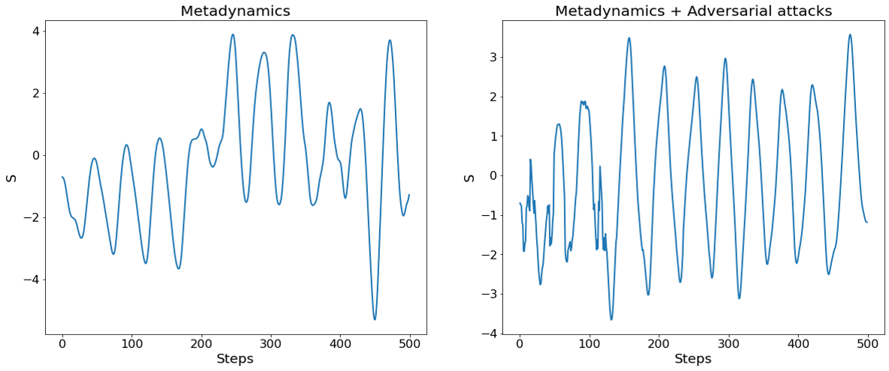

# Accelerating metadynamics by adversarial attacks on biasing potential
### Code:
CV_uncertainty.ipynb contains the code for enchanced metadynamics method applied to 1 dimensional potential well.

2D.ipynb contains the code for enchanced metadynamics method applied to 2 dimensional potential well.

alaninedypeptide.ipynb contains the code for enchanced metadynamics method applied to the real system containing alanine dypeptide.

### Metadynamics

Metadynamics is an enhanced sampling technic that allows us to estimate free energy of the system in the more efficient way than normal molecular dynamics (MD). How does it work? Let me explain this on the toy example of a particle in a potential well. If we initialize the particle at a random point of the well and run classical MD, the particle will go to the minimum and will be stacked there for quite a long time. There is a possibility for a particle to overcome the barrier, however, it is very low, therefore it will take us a long time to go to a different minimum and sample the whole collective variable space (Fig.1). Therefore, a more advanced technic, namely, metadynamics is needed.

 

 Figure 1.
 

Let’s take a look at metadynamics algorithm, which is also reffered to as a computational sand. Each time the particle visits a specific point in collective variable (CV) space, we will add a biasing potential to that point, which will add an additional force and make our particle go to another point in CV space. The bigger the time a particle will spend at one point the higher the barrier gets, which you can see from the formula below. After some time, the particle will explore the whole CV space and the sum of biasing potential together with the free energy will be constant, which allows us to estimate the free energy, using the following formula. 
 
 
 
  
 
 

 Metadynamics pseudocode.
 
  

  
### Why do we need to enhance metadynamics?
   
 Since the method is producing good results, the following question arises: why do we need to enhance metadynamics? First of all, even for relatively small systems, such alanine dipeptide, it will take the algorithm up to 100 ns to converge. For systems with a lot of atoms or systems like proteins it takes even longer to transverse the entire free energy landscape (𝜇𝑠). And last but not the least, in case of AIMD and NNFF it takes a lot of computational resources to run the trajectory even for few nanoseconds. Therefore, exploration of the configurational space using these computational methods is very expensive. To overcome these problems we suggest the use of adversarial attacks.
   
### Adversarial attacks on neural networks
   
 Adversarial attacks are meant to fool a neural network, be it classifier or regressor. The smallest addition of noise that will not be comprehensible in human eyes can make the neural network wrong. Adversarial attacks are mostly harmful threats to an existing ML model, but they can be used wisely as well. 

 

 Example of adversarial attack.
 
  

   
### Adversarial attack to improve Neural Force fields
   
 Neural Network inter-atomic potentials are currently very reliable, being able to predict with DFT accuracy but also lot faster. However, they are highly restricted to training data region. Adversarial attack has been recently used to sample geometry that NFF is highly uncertain about. These frames may have been achieved alternatively by molecular dynamics but they take up a lot of time. These adversarial attacks can obtain highly uncertain frames quite fast and then they can be put back in training data for active learning of the ML model.
 
 
 
  

### Accelerating metadynamics
   
   To combine metdynamics with adversarial attacks, first, we will initialize the three different trajectories within one ensemble, in our case NVE, and run these trajectories for some time. The resulting bias potential will be different for all three trajectories. When the bias potentials are less different from each other, it means that there is a higher possibility that they converged to the value of free energy and respective region of configurational space was explored enough. However, when they are very different from each other, which means there is high uncertainty, the opposite statement is true. Therefore our goal is to move to the place of the higher uncertainty.
   
   In order to implement that we suggest the following algorithm. Suppose, at the time t the CV of the first system has the value s1. First, we calculate the variance of bias potential for all points in configurational space. As was said earlier, our goal is to maximize the uncertainty. However, the following remark is very important. We want not only to maximize the uncertainty but we also want to prevent our system from going to the high-energy region. Therefore, we need to maximize the following function Q. After that we calculate the gradient of the Q with respect to s and move from point s1 to point s2, which will correspond in the following change of normal coordinates $\Delta r$. 
   
  
   
     

   
   To summarize the new approach, the algorithm for metadynamics with the use of adversarial attacks is presented below.
   
  
   
     

   
 ### 1D potential well
   
   For 1D double well, we start with three NVE trajectories with different initial position and velocities. Arbitrary units are chosen but to compare everything they are the same between metadynamics and adversarial attack. With adversarial attack, the bias potential became diffusive much earlier and thus we can sample faster and converge to free energy faster than actual metadynamics.
   
  
    
     

   
   ### 2D potential well
   
   For any CV we give, adversarial attacks help us to achieve uniformity along the CV-direction much faster than metadynamics. Even for a ‘bad’ CV.
   

 Metadynamics

  
    

 Metadynamics + Adversarial attacks

  
    

 As we mentioned before, the adversarial attacks ‘guide’ us in the CV-direction, while with metadynamics we have more disperse trajectory.
     

     
 

 Adversarial attacks, thus, help us to achieve the diffusive behavior in CV-direction much faster.
     

    

     
### Alanine Dipeptide
     
Alanine Dipeptide is a common case study for enhanced sampling. We took from paper w as 0.2kJ/mol and $\sigma$ as $17^0$. We took $\tau$ as 5fs with timestep of 0.5fs. The potential is a Schnet Neural force field trained on 160k dataset of varied range of torsion angles. A normal NVE run for 1ps was done to obtain atomic frames that can be compared with both methods. Three NVE ensembles were considered at different temp of 400 K, 500 K, 600 K.
     

     

 Each of the simulations were run for 50ps which is time consuming for NNFF. In one case, only metadynamics is used whereas in another adversarial attack is performed with a particular set of hyperparameters.
     

     

 Preliminary jumps in adversarial attack help to get out of local regions and thus sample faster and more space in 50ps.
     

     

     
### Summary
    
1. Adversarial attacks along with metadynamics has an edge over normal metadynamics . 
2. It gets to diffusive region in collective variable much faster and thus can contribute to faster convergence of free energy surface.
3. The hyper parameters perform intuitively and thus can be implemented by user’s discretion easily.
4. Moving from toy models, the method even works for molecular system like alanine dipeptide. It traverses more collective variable space than in normal metadynamics.
5. Since the adversarial attack serves as an extra push in the direction of change of collective variable, it achieves faster diffusion, which for any cv good or bad can lead to faster convergence. Therefore, we still need a good collective variable for sampling.
     
### References
    
1. https://sites.google.com/site/giovannibussi/gallery#TOC-Metadynamics
2. A. Laio and M. Parrinello, "Escaping free-​energy minima."Proceedings of the National Academy of Sciences99.20 (2002): 12562-​12566.
3. J. Phys. Chem. B 2018, 122, 21, 5508–5514.
4. D. Schwalbe-Koda, A. R. Tan, and R. Gómez-Bombarelli, Differentiable Sampling of Molecular Geometries with Uncertainty-Based Adversarial Attacks, Nat. Commun. In press (2021).
5. J. Phys. Chem. B 2010, 114, 16, 5632–5642
     
 
